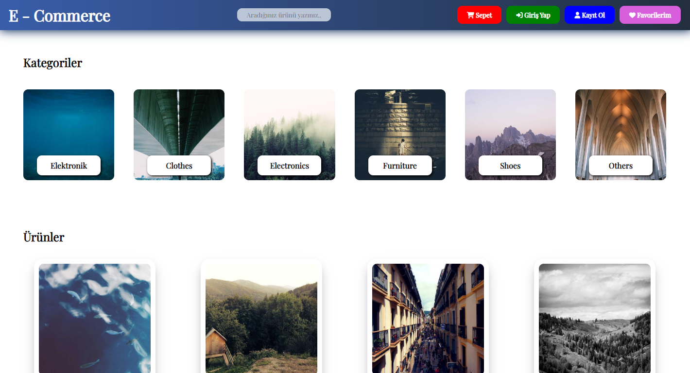

# E-Ticaret Sitesi ( E- Commerce Site )

# Yol Haritası

- Statik bir header oluşturma.

- API'dan kategori bilgisini alıp ve ekrana yansıtma.
- https://api.escuelajs.co/api/v1/categories

sayfa yüklendiği anda
categories uç noktasına istek at ve cevabı al

- API'dan ürünler bilgisini al ve ekrana yansıt
- https://api.escuelajs.co/api/v1/products

products uç noktası istek at ve cevabı al
gelen cevaptaki her bir obje için ekrana ürün yansıt
Sepet butonuna tıklanınca

bir pencere aç
içerisindeki X butonuna tıklanınca kapat
Sepete ekle butonuna tıklanıldığında:

sepete eklemek istediğin elemenı console yaz
sepete eklenen ürünü bir diziye aktar
sepet açıldığı anda dizideki ürünleri ekrana yansıt
sepet kapandığı anda modal'ın html'ini temizle
sepetteki ürünleri ekrana baserken fiyat değerleini topla ve bir değişkene aktar

bu işlemi yaprken elemanın miktarını unutma
ürün sepetten kladılırınca toplam fiyattan eksilt

# Kaynaklar

API : https://fakeapi.platzi.com/
Gölgelendirme : https://getcssscan.com/
İkonlar : https://fontawesome.com/ ve https://icons8.com/
Renk Geçişleri : https://www.grabient.com/
Yazı Stili : https://fonts.google.com/

<h2> Ekran Görüntüleri <h2>
  

<h3> GIF <h3>

